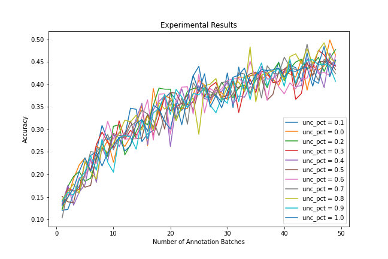

# Active Learning Demonstration
Christian Normand
 Capstone Project for General Assembly's Data Science Immersive Program

## Problem Statement
Can active learning techniques be used to reduce the amount of training images
required for a convolutional neural network (CNN) to reach target accuracy?

## What is Active Learning?
Active learning comprises a set of techniques for selecting data that will be
used to train a machine learning model. This often allows models to be trained
more efficiently with less data. The benefits of active learning are primarily
focused on supervised learning, which requires labeled training data. As
opposed to random sampling, active learning introduces a level of selectivity
into the data that is labeled and added to the training dataset. The goal is
for human annotators to spend their time labeling data that will have the
greatest impact on model training.

## About The Experiment
I wanted to see how different combinations of active learning techniques would
affect the amount of images required for a CNN to reach target accuracy. I used
images from the CIFAR-10 dataset, a popular dataset for computer vision
projects. Uncertainty sampling was the only technique I experimented with,
but I hope to add diversity sampling to the mix as time allows.

The model I used was able to classify images with 50% accuracy when trained on all of the training data. This is substantially better than the baseline of 10% (because there are 10 classes). However, it's nowhere near what other models have been shown to attain with the same dataset. This is because I chose a relatively simple model -  a CNN with only one hidden layer - for the sake of faster training.

I used a Google AI Notebook with 16 CPUs to run the experiment, which consisted of over 1,600 CNNs trained on differently sized training datasets using different sampling protocols. Each sampling protocol got a total of three trials and the results were averaged. I used the multiprocess module in Python to run trials concurrently. The result was essentially a "grid search" over different percentages of uncertainty sampling.

## Results
This particular model and dataset did not show any discernable response to uncertainty sampling. Results from the experiment are shown in the figure below:

It's clear to see, the model's accuracy followed the same trajectory regardless of the amount of uncertainty sampling. This is not to say that active learning is not beneficial for this dataset. It's possible that the model I used wasn't strong enough to see any sort of divergence in accuracy from uncertainty sampling. I would like to rerun this experiment using a stronger model - likely another CNN with more hidden layers. 

## References
- [Human-in-the-Loop Machine Learning by Robert (Munro) Monarch](https://www.manning.com/books/human-in-the-loop-machine-learning)
- [Machine Learning Mastery's article on CIFAR-10 Image Classification](https://machinelearningmastery.com/how-to-develop-a-cnn-from-scratch-for-cifar-10-photo-classification/)
- [CIFAR-10 Dataset](https://www.cs.toronto.edu/~kriz/cifar.html)
